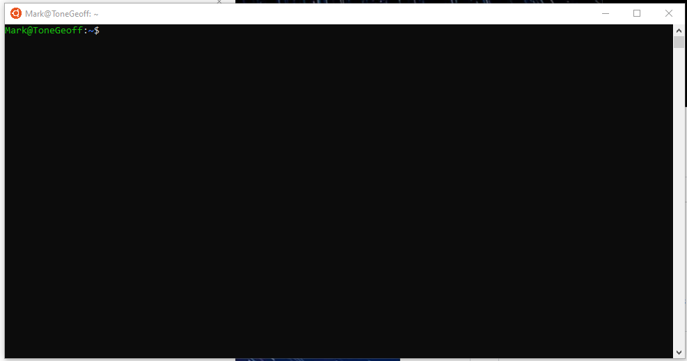
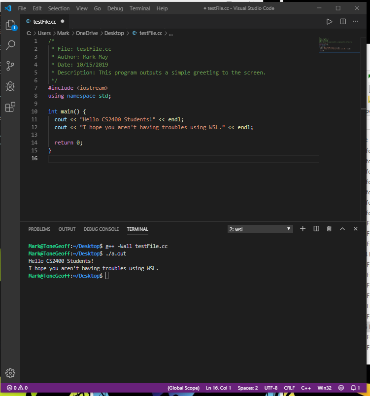

## Windows Subsystem for Linux
### Contact: Mark May (mm754313@ohio.edu)
---
<br>
If you see any mistakes or if there is anything that you think should be added to this please feel free to email me or tag me in a
comment. Also please let me know there is anything unclear here.


### What is Windows Subsystem for Linux?

Windows Subsystem for Linux (WSL) is an optional feature for Windows 10 created by Microsoft that will allow you to run a Linux terminal 
on your computer instead of having to use Command Prompt/Powershell. You can download most Linux programs and even run graphical applications
if you set it up correctly.

### Why would I use WSL instead of Command Prompt/Powershell?

The way that Windows and its command prompt/powershell work is different than how MacOS/Linux terminals work. If you have experience 
with working with both you might notice the a lot of the commands and programs that are available on MacOS/Linux terminals are vastly
different or even non-existant on Window's command prompt/powershell. For the purposes of CS2400 the usage difference between the two
won't matter too much, but if you are Computer Science major the differences might become challenging to deal with in your future classes.
If you would like a terminal with the same features as MacOS/Linux you could download a virtual machine or dual-boot your computer. But
switching back and forth and using both can be annoying and resource intensive. If you are running Windows 10 then there is a simpler
solution by Microsoft called Windows Subsystem for Linux. It is an optional feature you can enable that will allow you to download a 
distribution of Linux like Ubuntu onto your computer, and run the terminal as if it was a native Windows application.

### Download/Installation Instructions

The download/installation instructions can be found on the Microsoft website [here.](https://docs.microsoft.com/en-us/windows/wsl/install-win10)
When choosing a distribution of Linux to use I recommend using one of the latest versions of Ubuntu since that is what we use in the labs,
but you can use whichever one you prefer. 

After setting everything up you should be able to open a terminal that looks similar to:



To make sure everything is upto date run the command:

```bash
sudo apt-get update
```

Once you are done installing I recommend pinning it to your taskbar or add a shortcut to your desktop for easy access.

### Tools

After setting everything up you should have access to commands like `git`, `ssh`, and `scp`. You may also need to install the compiler `g++`.
To do this you can just run the command:

```bash
sudo apt install g++
```

If this fails, you may have forgotten to update your terminal in the installation instructions, so just run the `sudo apt-get update` command
that I mentioned earlier.

If you want the debugger `gdb` you can also install that:

```bash
sudo apt install gdb
```

VSCode is automatically set to work with WSL, so you can just download the regular Windows version of VSCode if you haven't already.
Then using the terminal you can open VSCode with the `code` command and it will automatically open VSCode on Windows. You can even use
the WSL terminal straight in VSCode:



### Accessing your Windows Files

When you open up WSL for the first time and you check to see what files you have in your home folder (using the `ls` command) you will
find that there are no files. You can create new files in WSL's home directory, but if you want to access your files already on your
hard drive you will have to look in a special directory called `mnt` located in the root folder.

```bash
mark@ToneGeoff:~$ cd /mnt/
mark@ToneGeoff:/mnt$ ls
c  f
mark@ToneGeoff:/mnt$    
```

Here you will have special folders that will lead to the hard drives you have on your computer. Most likely your regular files will be
located in `c`.

From there you can access all your other files. Depending on how you have your file structure laid out you might need to modify this a
little, but if you hypothetically wanted to access your desktop you could enter:

```bash
cd /mnt/c/Users/<your-windows-user-name>/Desktop
```

Or if you wanted to access your Documents folder you could do:

```bash
cd /mnt/c/Users/<your-windows-user-name>/Documents
```

To make things easier you can create a symbolic link in your WSL home folder that links directly to any important folders you might
need to access. This symbolic link will be like a folder, that when you go into it using the `cd` command will lead you directly to
whatever it is linked to. To create this symbolic link you can use the command:

```bash
ln -s <full-path-to-the-folder> <name-of-folder>
```

For example, for me to create a symbolic link to my Desktop I can do:

```bash
mark@ToneGeoff:~$ cd
mark@ToneGeoff:~$ ln -s /mnt/c/Users/Mark/Desktop Desktop
mark@ToneGeoff:~$ ls
Desktop
mark@ToneGeoff:~$ cd Desktop
mark@ToneGeoff:~/Desktop$ ls
desktop.ini
```

Now I can access myself Windows desktop directly from my WSL home folder by doing:

```bash
cd ~/Desktop
```

I recommend creating more symbolic links to any other important folders you might need to access regularly. For example, I have links
to my desktop, my downloads folder, any folders I use for my programming classes, and my documents.

### SSH / SCP

Now that you have a Linux terminal you can use the `ssh` and `scp` commands to connect to the lab machines without having to download 
extra SSH/SCP clients like PuTTY or WinSCP/CyberDuck. These commands are the same as if you were using MacOS/Linux. To do this you're
going to need one of the addresses for our Lab Machines (`pu1.cs.ohio.edu`, `pu2.cs.ohio.edu`, etc), and you're also going to need
your username and password for the lab machines.

If you want to access the lab machines terminals and go through it as if you were actually there you can use the `ssh` command:

```bash
ssh <your-lab-machine-username>@pu1.cs.ohio.edu
```

And when prompted enter your password.

You can also copy files to and from the lab machines using the `scp` command:

```bash
scp <your-lab-machine-username>@pu1.cs.ohio.edu:<path-to-file-on-the-lab-machines> <path-on-your-machine-where-you-want-to-copy-to>
```

For example, for me to log onto the lab machines I can do:

```bash
mark@ToneGeoff:~$ ssh mmay@pu1.cs.ohio.edu
mmay@pu1.cs.ohio.edu's password:

  RATHER THAN SSH INTO A WORKSTATION IN THE LABS , PLEASE USE OUR SERVERS.
No mail.
Last login: Tue Oct 15 16:31:39 2019 from xxx.xxx.xxx.xxx
mmay@pu1:~$ 
```

And if I wanted to copy a file from Nasseef's directory on the lab machines I can do:

```bash
mark@ToneGeoff:~$ scp mmay@pu1.cs.ohio.edu:/home/nabukama/2400/lab1.cc .
mmay@pu1.cs.ohio.edu's password:
lab1.cc                                                                                                 100%  409     8.5KB/s   00:00
mark@ToneGeoff:~$ ls
Desktop  lab1.cc
mark@ToneGeoff:~$
```

The `scp` command works like the regular `cp` command, except you just specify the address to the server you're copying from first before
the path to the directory.
