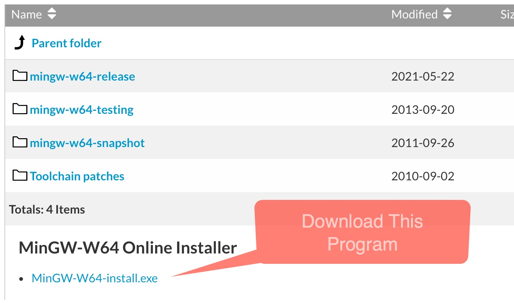
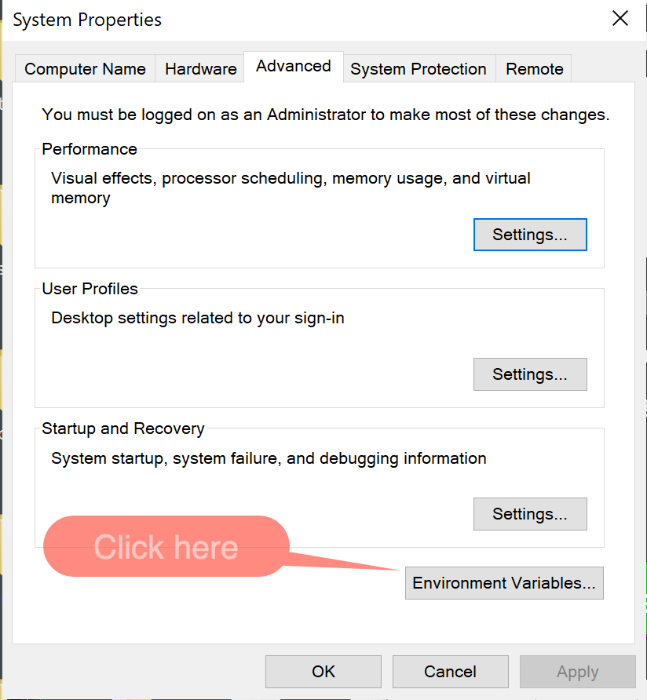
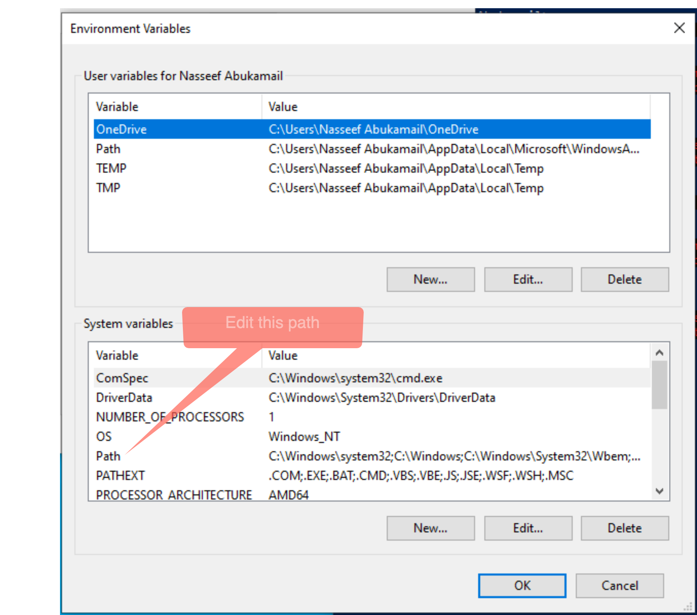

## Installing minGW-64 C/C++ compiler on Windows
### Contact: Nasseef Abukamail (abukamai@ohio.edu)

1. Download [MinGW-64](https://sourceforge.net/projects/mingw-w64/files/mingw-w64/). Download the file `MinGW-W64-install.exe`
   
   
2. Run the installer and select all the default values
3. Edit the system environment variables under settings (Search for: "`Edit the system environment variables`")
   
   

4. Click to edit the evnironment variables
   
   

5. Select `Edit System Environment Variables`.
   
   
    > Note: If you have an older version of MinGW installed, remove any path that references it.
   
6. Under system variables (bottom section), click on the `Path` variable, click `Edit`, then `New`, and add the the following path:
    ```console
    C:\Program Files (x86)\mingw-w64\i686-8.1.0-posix-dwarf-rt_v6-rev0\mingw32\bin
    ``` 

7. Click `OK` on all the dialog boxes to save the changes.

8.  Restart your terminal and `VSCode` for the changes to take effect.
9.  To verify that the installation is complete, open `PowerShell` and type the command `g++ --version` you should see a reference to `MinGW-W64 project`.
   
    